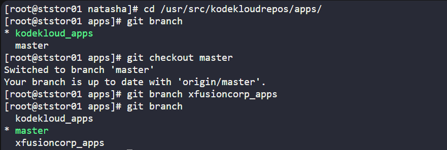

### Task: Git Create Branches

The Nautilus development team is working on the `/usr/src/kodekloudrepos/ecommerce` repository and wants to implement new features in a separate branch.  

- On the Storage Server in Stratos DC, create a new branch named `xfusioncorp_ecommerce` from the `master` branch.  

### Solution - 

