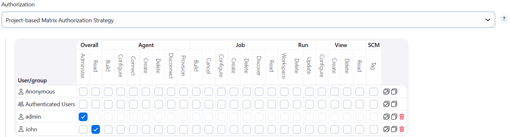
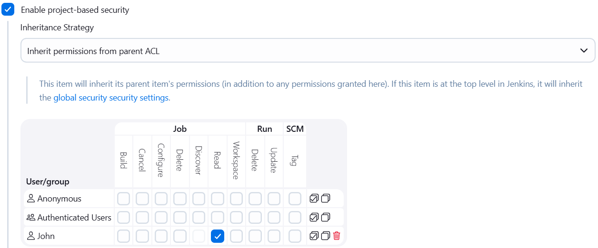

### Task - Configure Jenkins User Access

Configure user access and permissions in Jenkins for the development team by performing the following actions:
- Access the Jenkins UI using the provided admin credentials.
- Create a new Jenkins user named `john` with the specified password `TmPcZjtRQx` and full name.
- Enable `Project-based Matrix Authorization Strategy` in Jenkins.
- Assign Overall `Read permission` to the `john` user.
- Remove all permissions assigned to Anonymous users, ensuring the admin user retains Overall `Administer permission`.
- For the existing Jenkins job, grant the john user only Job `Read permission` and no other access.

### Solution

#### 1. Login to Jenkins

Login with:
```sh
Username: admin
Password: Adm!n321
```

#### 2. Install Matrix Authorization Strategy Plugin

- Go to Manage Jenkins > `Manage Plugins` > `Available tab` > `Search for Matrix Authorization Strategy`
- Select the plugin and click Install without restart,Restart Jenkins if prompted

#### 3. Create Jenkins User

- Go to Manage Jenkins > Manage Users > Click Create User
- Enter:
```sh
Username: john
Password: TmPcZjtRQx
Full Name: John
Click Create User
```

#### 4. Enable Project-based Matrix Authorization

- Go to Manage Jenkins > Configure Global Security > Under Authorization > select Project-based Matrix Authorization Strategy
- Add users:
```sh
admin
john
```



#### 5. Configure Global Permissions

- For admin: Enable Overall > `Administer`
- For john: Enable Overall > `Read`
- For Anonymous: Remove all permissions

Click Save.

#### 6. Configure Job-level Permissions

- Open the existing Jenkins job
- Click Configure > Scroll to Project-based Security > Add user john > Grant only: Job -> `Read`

