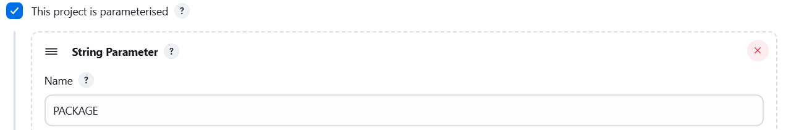
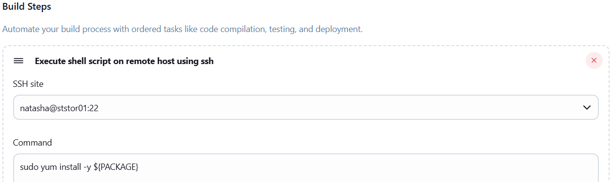

### Task - Configure Jenkins Job for Package Installation

The Nautilus DevOps team installed and configured a new Jenkins server so they wanted to create a Jenkins job to automate this task. Find below more details and complete the task accordingly:
- Access the Jenkins UI by clicking on the Jenkins button in the top bar. Log in using the credentials: username `admin` and password `Adm!n321`.
- Create a new Jenkins job named `install-packages` and configure it with the following specifications:
  - Add a string parameter named `PACKAGE`.
  - Configure the job to install a package specified in the `$PACKAGE` parameter on the `storage server` within the Stratos Datacenter.

### Solution - 

#### 1: Configure SSH and sudo on Storage Server
```sh
# Generate SSH key on Jenkins server:
ssh-keygen -t rsa -b 2048

# Copy SSH public key to storage server:
ssh-copy-id natasha@ststor01

# Login to storage server and edit sudoers:
ssh natasha@ststor01

# Add the following line:
sudo visudo
natasha ALL=(ALL) NOPASSWD: ALL
```

#### 2: Configure Jenkins SSH Plugin
Login to Jenkins UI as admin.
- Go to Manage Jenkins > Manage Plugins > Install `SSH plugin`.
- Go to Manage Jenkins > Manage Credentials:
- Add SSH credentials
```sh
Username: natasha
Private Key: paste Jenkins server private key
```
- Go to Manage Jenkins > Configure System > Add SSH host
```sh
Hostname: ststor01
Port: 22
Credentials: natasha
```

#### 3: Create Jenkins Job
- Job name: `install-packages`
- Select Freestyle project
- Enable This project is parameterized

```sh
Add String Parameter
Name: PACKAGE
```
- Configure Build Step > Under Build, select `Execute shell script on remote host using SSH`
- Add command:
```sh
sudo yum install -y ${PACKAGE}
```


#### 4: Run the Job
- Click Build with Parameters
- Enter package name (example):
```sh
vim
```
- Click Build