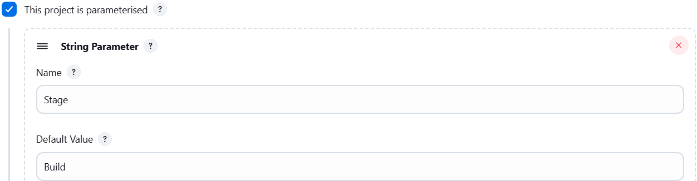
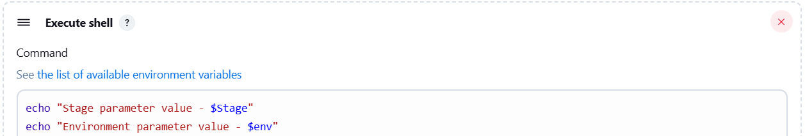

### Task - Jenkins Parameterized Builds

Create and test a simple parameterized Jenkins job to understand parameterized builds.
- Login to Jenkins using admin credentials.
- Create a parameterized job named `parameterized-job`.
- Add a `string parameter` `Stage` with default value `Build`.
- Add a `choice parameter` `env` with values `Development, Staging, and Production`.
- Configure the job to `echo both parameter values`.
- Run the job at least once with env set to Staging.

### Solution - 

#### 1: Create Parameterized Jenkins Job

- Login to Jenkins using:
```sh
Username: admin
Password: Adm!n321
```
- Click New Item and create a Freestyle project named `parameterized-job`.
- Enable This project is parameterized and add:
  - String parameter `Stage` with default value `Build`.
  
  - Choice parameter `env` with choices `Development, Staging, Production`.
  

#### 2: Configure Build Command

- In the Build section, add Execute shell.
- Add the following command to echo parameter values:
```sh
echo "Stage is: $Stage"
echo "Environment is: $env"
```


#### 3: Build and Verify

- Click Build with Parameters.
- Select `env` as `Staging` and trigger the build.
- Verify the build succeeds and parameters are printed in the console output which is `Staging`.