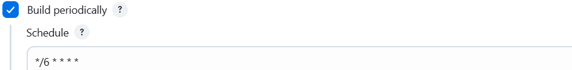
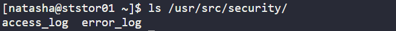

### Task - Jenkins Scheduled Jobs

Create a Jenkins job to periodically collect Apache logs from App Server 1 and store them on the Storage Server.
- Login to Jenkins using admin credentials.
- Create a Jenkins job named `copy-logs`.
- Configure the job to run every `6 minutes`.
- Copy Apache `access_log` and `error_log` from App Server 1 (default log location) to
`/usr/src/security` on the `Storage Server`.

### Solution -

#### 1: Configure SSH Access Between Servers

**1. Generate SSH key on Jump Host and copy to App Server 1**
```sh
ssh-keygen -t rsa -b 2048
ssh-copy-id stapp01
```
Why:
Allows passwordless SSH access from the Jump Host to App Server 1 for setup and verification.

**2. Login to App Server 1 and generate SSH key and copy to storage server**
```sh
ssh tony@stapp01
ssh-keygen -t rsa -b 2048
ssh-copy-id natasha@ststor01
```
Why:
App Server 1 will copy the logs to storage server, so it needs its `own SSH key`.

#### 2: Configure Jenkins SSH Plugin

- Login to Jenkins UI as admin.
- Go to Manage Jenkins > Manage Plugins > Install the `SSH plugin`.
- Add `SSH Credentials` in Jenkins
- Go to Manage Jenkins > Manage Credentials > Add new credentials > Kind: `SSH Username with private key`
  - Username: `tony`
  - Private Key: `Paste the private key created on the Jump Host`

#### 3: Configure SSH Host in Jenkins

- Go to Manage Jenkins > Configure System > Under `SSH remote hosts`, add:
  - Hostname: `stapp01`
  - Port: `22`
  - Credentials: previously added SSH credentials

#### 4: Create Jenkins Job

- Click New Item, Enter job name: `copy-logs`, Select `Freestyle project`.
- Enable `Build periodically` , Set cron schedule:
```sh
*/6 * * * *
```


Why:
Runs the job every 6 minutes automatically.

- Go to `Build`, Click Add build step > `Execute shell script on remote host using SSH`.
- Select remote host: `stapp01`.
- Add the following command:
```sh
scp /var/log/httpd/access_log /var/log/httpd/error_log natasha@ststor01:/usr/src/security
```
Why:
Copies Apache access and error logs from App Server 1 to the Storage Server.

#### 5: Verify

- Click Build Now once to verify and check the console output.
- login into storage server and then run ls /usr/src/security manually

- Jenkins will continue running automatically every 6 minutes.