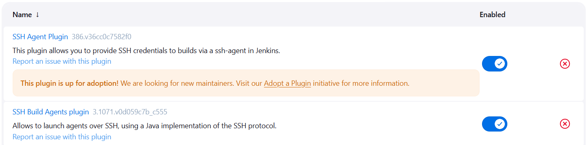

### Task - Jenkins Slave Nodes

Configure all app servers as Jenkins SSH build agent (slave) nodes.
- Login to Jenkins using admin credentials.
- Add all app servers as slave nodes with specific names `App_server_1, App_server_2, App_server_3`.
- Assign labels to each node `stapp01, stapp02, stapp03`.
- Configure correct remote root directories `/home/tony/jenkins`, `/home/steve/jenkins`, `/home/banner/jenkins`.
- Ensure all slave nodes are online and working.

### Solution - 

**Prerequisites - Configure ssh acess and install java on each agent**
Before adding slave nodes in Jenkins, ensure the following on each app server:
- Java (11 or 17) is installed.
- SSH access is available from Jenkins server (from jumphost using ssh-keygen, ssh-copy-id to each slave node).
- Remote directories exist and are writable.

#### 1. Login to Jenkins

Login using:
```sh
Username: admin
Password: Adm!n321
```

#### 2. Install Required Plugins

Install the `required plugins` 
Go to Manage Jenkins > Manage Plugins > Install:

- SSH Agent Plugin
- SSH Build Agents Plugin

Restart Jenkins if prompted.


#### 3. Configure SSH Credentials

- Copy the same `private SSH` key into `Jenkins credentials`.
- Create credentials for each user using that key: For each user `(tony, steve, banner)`:
- Go to Manage Jenkins > Manage Credentials
- Add credentials:
  - Kind: `SSH Username with private key`
  - Username: `tony / steve / banner`
  - Private Key: `paste the same SSH private key`

#### 4. Add App Server 1 as Slave Node

- Go to Manage Jenkins > Nodes > Click New Node
- Configure:
  - Node name: `App_server_1`
  - Type: `Permanent Agent`
  - Remote root directory: `/home/tony/jenkins`
  - Labels: `stapp01`
  - Launch method: Launch `agent via SSH`, `Host: stapp01`, `Credentials: tony`

#### 5. Add App Server 2 and App Server 3

**Repeat the same steps as App_server_1 with the following values:**
- `App_server_2	stapp02	  steve	  /home/steve/jenkins`	
- `App_server_3	stapp03	  banner  /home/banner/jenkins`	

#### 6. Verify Slave Nodes

Go to Manage Jenkins > Manage Nodes and Clouds, Ensure all nodes show Online status.
