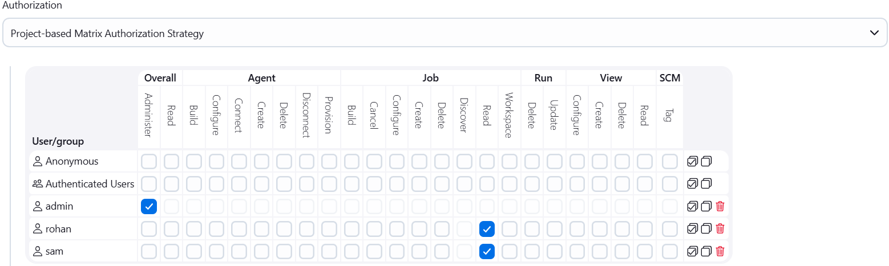
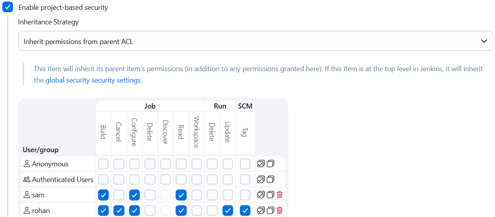

### Task - Jenkins Project Security

Grant job-level permissions for existing users on a specific Jenkins job.
- Login to Jenkins using admin credentials.
- Use the existing job Packages.
- Grant `job-specific permissions` to users `sam` and `rohan`.
- Ensure `Inherit permissions from parent ACL` is selected.

### Solution - 

#### 1. Login to Jenkins

```sh
Username: admin
Password: Adm!n321
```

#### 2. Configure Global Access (minimum)

- Install `Matrix Authorization Strategy Plugin` and Restart.
- Go to Manage Jenkins > Configure Global Security > authorization > create user `sam, rohan` > Ensure users have `Read access` so they can see `Jenkins/jobs`.



#### 3. Configure Job-level Permissions for Packages

- Open the Packages job.
- Click Configure > Under `Authorization` / `Project-based Matrix Authorization` > Select `Inherit permissions from parent ACL` > Add users and permissions:
- For sam:
  - `Job - Read, Build Configure`
- For rohan:
  - `Job - Read, Build, Cancel, Configure, Update, Tag`

